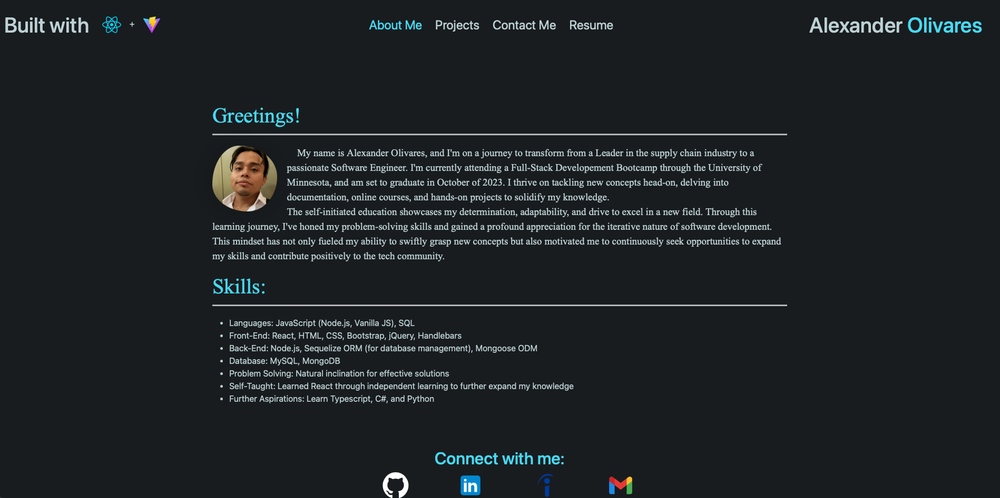
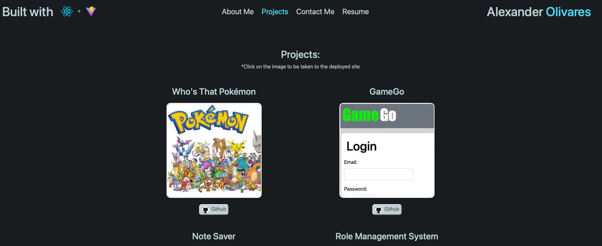

# React-Portfolio

## Description

This React portfolio was created prior to covering the React module in the bootcamp. I have since edited and redesigned it to match the expected criteria of the module. However, I took on this challenge and learning React on my own to show my dedication and determination to learning new technologies. To demonstrate that I have since starting the bootcamp, learned how to learn as well as how to adapt. I strongly believe that learning how to learn is the greatest skill that this course has taught me. From diving into complex documentation and online courses, this project was built to show my sheer determination and commitment to continuous improvement, problem solving, and facing challenges head on. 

## Table of Contents

- [Installation](#installation)
- [Usage](#usage)
- [Credits](#credits)
- [License](#license)
- [Contributions](#how-to-contribute)
- [Tests](#tests)
- [Questions](#questions)

## Installation

N/A

## Usage

Navigate to: https://alexanderolivares13.github.io/React-Portfolio

Click on the different sections in the navbar to be taken shown the respective content:

About me:

Projects:

## Credits

N/A

## License

This project is licensed under the MIT License

## How to Contribute

N/A

## Tests

N/A

## Questions

My work can be found on Github at [alexanderolivares13](https://www.github.com/alexanderolivares13)

If you have any further questions you can contact me at my email at: [alexander.olivares1310@gmail.com](mailto:alexander.olivares1310@gmail.com)
